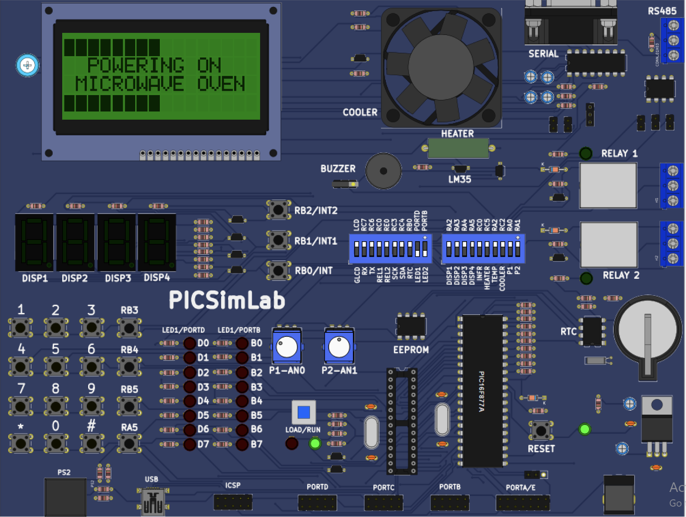
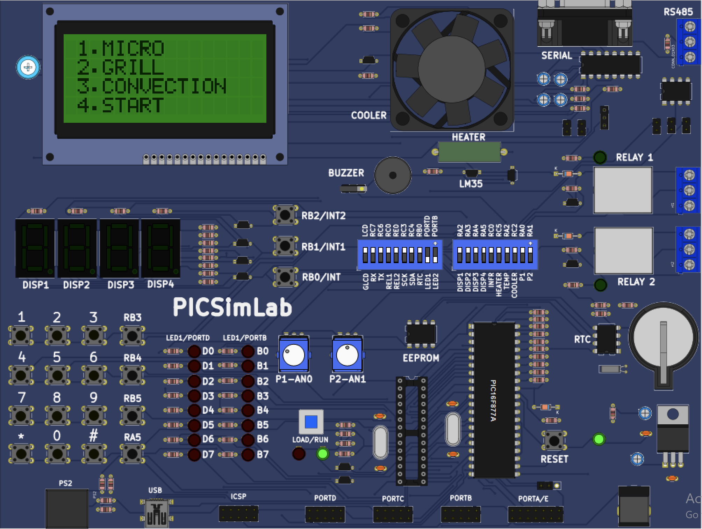
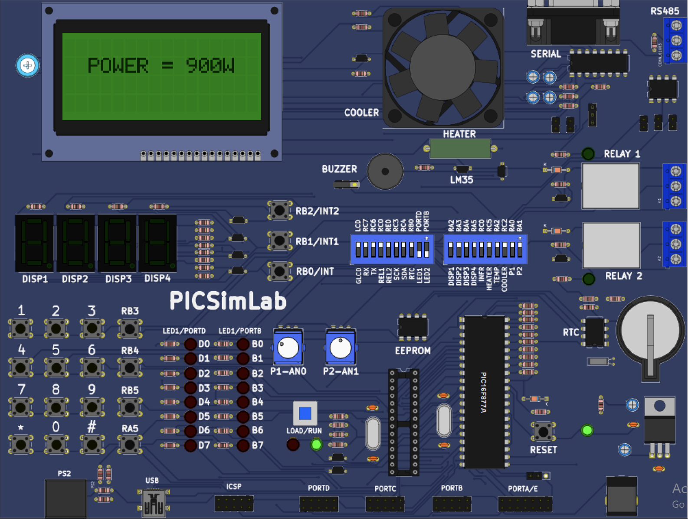
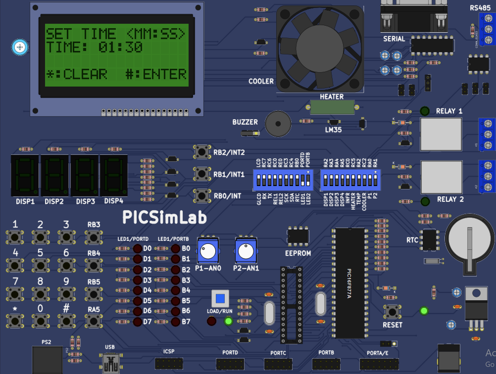

# 🍽️ Microwave Oven Simulation using PIC16F877A

A feature-rich **Microwave Oven Simulation** developed in **Embedded C** using the **PIC16F877A Microcontroller** on the **PICSimLab** platform.

The project emulates the workflow of a real microwave oven, including multiple cooking modes, timer configuration, convection pre-heating, fan control, buzzer notifications, and an interactive 16x4 Character CLCD user interface.

---

## 📌 Project Overview

This project was developed to demonstrate the implementation of an embedded real-time application using finite state machine (FSM) concepts, timers, keypad interfacing, CLCD display management, and peripheral control.

The application provides an intuitive menu-driven interface that allows users to select different cooking modes, configure cooking time and temperature, monitor cooking progress, and receive completion notifications.

---

## ✨ Features

- Interactive **16x4 Character CLCD Menu**
- Matrix Keypad based user interface
- Multiple cooking modes
  - Micro Mode
  - Grill Mode
  - Convection Mode
- Adjustable cooking timer
- Temperature configuration for convection cooking
- Automatic pre-heating sequence
- Fan control during cooking
- Buzzer indication after cooking completion
- Pause / Resume functionality
- Add 30 Seconds Quick Start feature
- Stop and return to Main Menu
- Timer countdown using interrupts
- Modular Embedded C implementation

---

# 🛠 Hardware Used

| Component | Description |
|-----------|-------------|
| Microcontroller | PIC16F877A |
| Display | 16x4 Character CLCD |
| Input | Matrix Keypad |
| Fan | DC Cooling Fan |
| Buzzer | Piezo Buzzer |
| Timer | Internal Timer |
| IDE | MPLAB X IDE |
| Compiler | XC8 Compiler |
| Simulator | PICSimLab |

---

# 📂 Project Flow

```text
Power ON
      │
      ▼
Powering ON Animation
      │
      ▼
Main Menu
      │
      ├── Micro Mode
      │       │
      │       ├── Display Power
      │       ├── Set Time
      │       └── Cooking
      │
      ├── Grill Mode
      │       │
      │       ├── Set Time
      │       └── Cooking
      │
      ├── Convection Mode
      │       │
      │       ├── Set Temperature
      │       ├── Pre-Heating
      │       ├── Set Time
      │       └── Cooking
      │
      └── Start
              │
              ▼
      Timer Running
              │
              ├── Add 30 Seconds
              ├── Pause
              ├── Resume
              └── Stop
              │
              ▼
        Time Up
              │
              ▼
    Buzzer + Fan OFF
              │
              ▼
        Main Menu
```

---

# ⚙️ Cooking Modes

## 1️⃣ Micro Mode

- Displays cooking power (900W)
- User sets cooking time
- Starts countdown
- Fan runs during cooking
- Buzzer rings after completion

---

## 2️⃣ Grill Mode

- Time-based cooking
- No power display
- Fan operates while cooking
- Buzzer indicates completion

---

## 3️⃣ Convection Mode

Additional features include:

- Temperature configuration
- Maximum temperature: **180°C**
- Automatic **60-second pre-heating**
- After pre-heating, cooking timer begins
- Fan runs throughout cooking

---

# 🚀 Functionalities

### Power ON Animation

- Startup welcome screen
- Simulates microwave boot sequence

---

### Timer Configuration

- MM:SS format
- Numeric keypad entry
- Clear option
- Enter confirmation

---

### Temperature Setting

- Available only in Convection Mode
- User configurable
- Maximum temperature supported:
  **180°C**

---

### Cooking Screen

Supports:

- Start
- Pause
- Resume
- Stop
- Add 30 Seconds

---

### Completion Notification

When timer reaches zero:

- Fan turns OFF
- Buzzer turns ON
- CLCD displays

```
TIME UP

Enjoy your Meal!
```

Then automatically returns to Main Menu.

---

# 📷 Project Demonstration

## Power ON Screen



---

## Main Menu



---

## Microwave Power Display



---

## Time Configuration



---

## Temperature Configuration


---

## Convection Pre-Heating


---

## Cooking Screen


---

## Cooking Completed


---

# 🔧 Software Concepts Used

- Embedded C
- Finite State Machine (FSM)
- Modular Programming
- Timer Interrupts
- CLCD Driver
- Matrix Keypad Driver
- GPIO Programming
- Peripheral Interfacing
- Real-Time Event Handling

---

# 📁 Project Structure

```text
Microwave_Oven/
│
├── main.c
├── microwave.c
├── microwave.h
├── keypad.c
├── keypad.h
├── clcd.c
├── clcd.h
├── timer.c
├── timer.h
├── interrupt.c
├── interrupt.h
├── power_on.png
├── main_menu.png
├── power.png
├── set_time.png
├── set_temperature.png
├── pre_heating.png
├── run_mode.png
├── meal_ready.png
└── README.md
```

---

# 🎯 Learning Outcomes

This project strengthened my understanding of:

- Embedded System Design
- PIC16F877A Architecture
- Timer Interrupt Programming
- CLCD Interface
- Matrix Keypad Scanning
- Event-driven Programming
- State Machine Design
- Real-time Embedded Application Development
- Peripheral Control and Hardware Interfacing

---

# 📖 Future Improvements

- EEPROM storage for last cooking settings
- RTC integration
- Door open/close detection
- Child lock feature
- Multiple power levels
- Defrost mode
- Auto cooking presets
- Audible keypad feedback
- Temperature sensing using LM35
- UART debugging support

---

# 👨‍💻 Author

**Yogesh B**

Embedded Systems | C Programming | PIC16F877A | Embedded C | Microcontrollers

---

⭐ If you found this project useful, consider giving this repository a **Star**.
